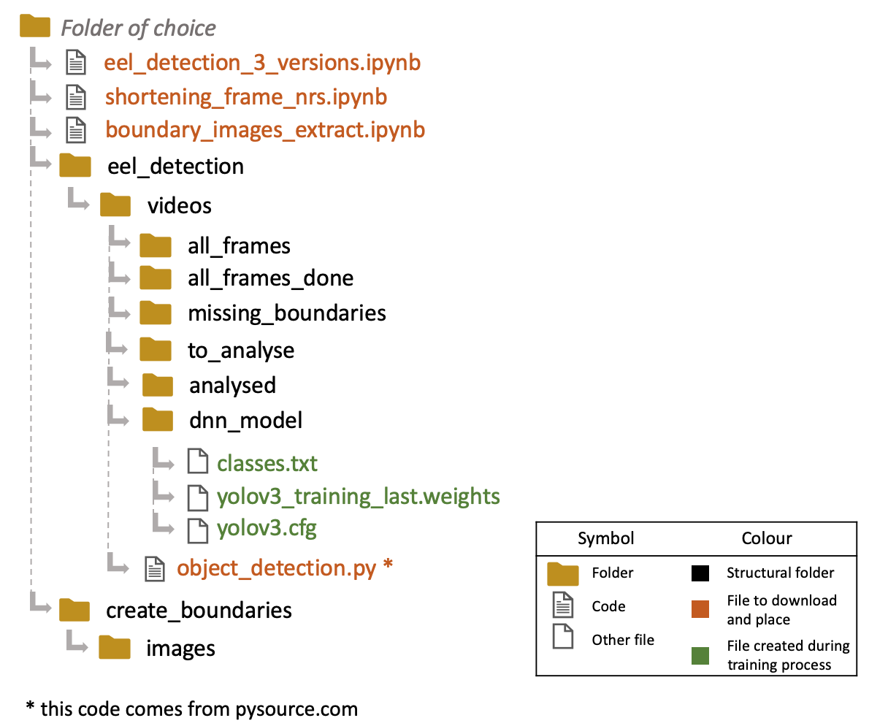
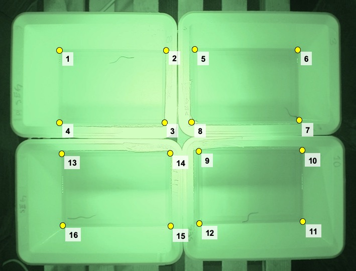

### Description of the setup:
This set of codes was designed for a project where juvenile eels were filmed during a five minute period. There were up to four eels in each video, all kept in separate boxes. The videos were analysed using Python (Jupyter Notebook via Anaconda) and R. 
The following packages are required:
* opencv (python)
* shapely (python)
* Geomorph (R)
 

### Description of the file structure to be:
The following diagram shows the file structure. Note that the codes do not create this folder structure if it does not exist, so the necessary folders must be present before running the codes.

 
NOTE: the R code is not included in the diagram since it can be placed in any folder as the working directory is instead specified in the code
 
 

### Training the model:
The training uses YOLOv3 and was done following the instructions and accompanying code of <a href="https://pysource.com/2020/04/02/train-yolo-to-detect-a-custom-object-online-with-free-gpu/">pysource.com</a>
 
 

### Description of the different codes:
**shortening_frame_nrs** (Jupyter Notebook) 
This code is used to decrease the number of frames in the video, going through every video in the "all_frames" folder. In the example code, every fifth frame is saved. The shortened videos are saved in the folder "missing_boundaries", and the original videos are moved to "all_frames_done".

**boundary_image_extract** (Jupyter Notebook) 
This code extracts the first image for each video in the folder "missing_boundaries" and saves them to "create_boundaries/images", for later use in selecting the boundaries of the container housing the eels. The video is moved to the folder "to_analyse".

**select_boundaries** (R) 
Note that although the package and code used in this section was designed for morphometric analyses, the code included here has retrofitted it for the purpose of extracting a csv file with coordinates for the boxes. If coordinates are produced through other means, be aware that the following python codes invert the y-axis due to the different treatments of the position of the origo (in R it is in the bottom left, in python it is in the top left).
This code shows one image from the folder "create_boundaries/images" at a time, allowing you to select the boundaries for the containers. The setup is for four square containers, where you select 16 points in total. The order of selection is shown in the image below

After each selection, you decide whether to accept the point or not. To accept the point, select "y", to reposition it, select "n". There "a" alternative exists but is not useful for this code. The positions are saved as a .tps file. This code also contains another section that transforms the .tps file into a .csv file that can then be used by the other codes. This .csv file is saved as "Box_boundaries.csv".

**eel_detection_3_versions** (Jupyter Notebook) 
This code includes three versions of the tracking code. The three codes are different variants on the same code, i.e. detecting and tracking the eels, but are used for different things, and are explained below. 
1. *Tracking and saving without showing the video*. This code goes through the videos in the "to_analyse" folder. If the video lacks data for the boundaries of the boxes, the video will be skipped and placed in the "missing_boundaries" folder. If there is boundary data for the video, the eels will be tracked, the data saved as "Eel_coordinates.csv", and the video moved to the "analysed" folder. Any duplicate detections in a box, indivating at least one false detection, is saved as "Dupes_in_boxes.csv". This code does not show the video as it is being processed.
2. *Tracking and saving showing video*. This code does the same as the previous code, saving the data and moving the videos to the "analysed" folder. However, it also shows the video as the eels are being tracked and can therefore be used if you suspect wrongful detection and want to see what the programme identifies as an eel.
3. *Tracking with video without saving*. This code goes through the videos in the "to_analyse" folder in the same way as the previous two codes, skipping videos without boundary data. However, while the eels are tracked, the data is not saved. This code shows the videos as the eels are being tracked and can therefore be used if you suspect wrongful detection but do not wish to save the data. This can be practical if you already have the data saved and simply want to rewatch a badly detected video.
